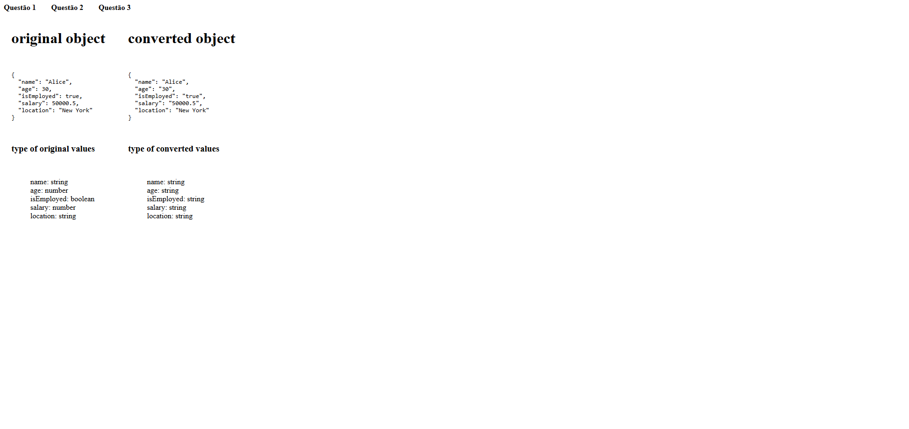

# Desafios de [Alex Alan Nunes](https://github.com/alexalannunes) (React)



## Descrição

Este projeto contém uma série de desafios propostos por [Alex Alan Nunes](https://github.com/alexalannunes). Cada desafio está separado em diferentes páginas dentro do diretório `(pages)`, e cada um aborda diferentes aspectos do desenvolvimento com React e TypeScript.

## Iniciando o projeto

```bash
# Clonar aplicação
$ git clone https://github.com/sillasemanoel/alex-s-challenges.git

# Acessar a aplicação
$ cd alex-s-challenges

# Execute npm para instalar as dependências
$ npm install

# Para iniciar a aplicação
$ npm run dev

```

## Ferramentas

- React
- React Router DOM
- Styled Components
- Vite

## Aprendizados importantes

- Navegação com React Router
- Estilização com Styled Components
- Configuração de projetos com Vite
- Manipulação de dados e estados em React

## Funcionalidades

- Navegação entre diferentes desafios;
- Exibição de resultados dinâmicos;
- Estilização consistente com Styled Components;
- Configuração e build com Vite.